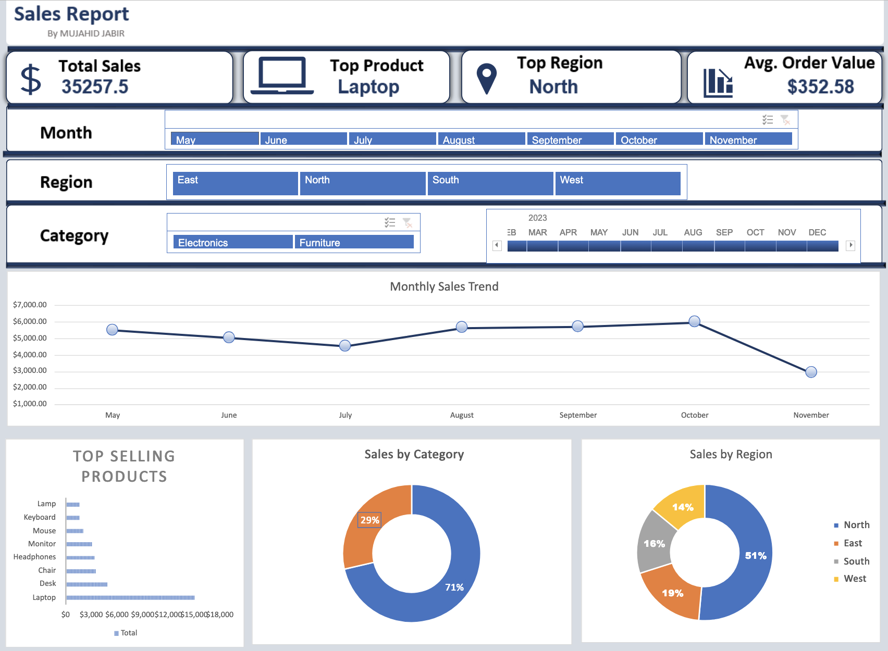

  

# 📊 Sales Dashboard – Interactive Excel Analytics Project

A fully interactive and visually refined **Sales Dashboard** built using Microsoft Excel.  
This project demonstrates strong skills in **data cleaning, KPI development, dashboard design, and business analytics**—making it ideal for portfolio presentation and real‑world decision support.

---

## 🚀 Project Overview
This project delivers a complete analytical workflow starting from raw sales data all the way to a polished, interactive dashboard.

The dashboard enables users to:
- Explore sales performance across regions, products, and customers  
- Identify trends and patterns  
- Monitor KPIs in real time  
- Make informed business decisions based on clean, structured insights  

It is designed with clarity, usability, and professional presentation in mind.

---

## ⭐ Key Features
- Interactive Excel dashboard with dynamic slicers  
- Automated KPI calculations  
- Clean and structured data model  
- Professional charts and visual storytelling  
- Region, product, and customer-level insights  
- Trend analysis and discount impact evaluation  

---

## 📈 KPIs Included
| KPI | Description |
|-----|-------------|
| **Total Revenue** | Total sales revenue across the selected period |
| **Units Sold** | Total number of units sold |
| **Average Discount** | Average discount applied across all transactions |
| **Top Region** | Region generating the highest revenue |

---

## 🗂️ Dataset Description
The dataset contains detailed sales transactions with the following fields:

- **Date**  
- **Region**  
- **Product**  
- **Units Sold**  
- **Unit Price**  
- **Discount**  
- **Total Revenue** (calculated)

### Data Files Included:
-  – original dataset  
-  – cleaned and standardized dataset  
- Calculated fields used for KPIs and dashboard visuals  

---

## 🖼️ Dashboard Screenshots

  

---

## 🛠️ Tools & Techniques Used
- Microsoft Excel  
- Pivot Tables & Pivot Charts  
- Slicers & Interactive Filters  
- Data Cleaning & Normalization  
- Conditional Formatting  
- KPI Calculation  
- Visual Dashboard Design  

---

## 📥 How to Use
1. Download and open the file:  
   
2. Use the slicers to filter by:
   - Date  
   - Region  
   - Product  
   - Customer  
3. Explore the interactive charts and KPIs  
4. Refer to the  for a full explanation of the workflow and methodology  

---

## 📁 Project Structure
