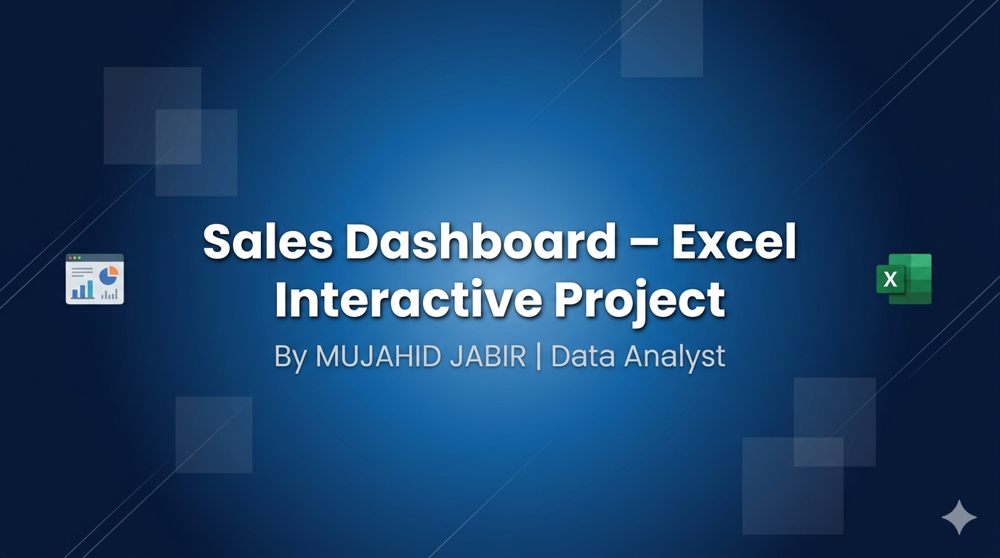

  

# 📊 Excel Sales Dashboard – Interactive Analytics Project  
**Created by: MUJAHID JABIR | Data Analyst**

## 📌 Project Overview  
This project showcases a fully interactive **Sales Performance Dashboard** built using Microsoft Excel.  
It provides insights into monthly sales trends, top‑selling products, regional performance, and category contribution.  
The dashboard is designed to support business decision‑making through dynamic filtering and clear visualizations.

---

## 📂 Dataset Description  
The dataset contains **100 sales transactions** with the following fields:

- Order ID  
- Date  
- Product  
- Category  
- Region  
- Quantity  
- Unit Price  
- Discount  
- Total Revenue  
- Month  
- Month #

---

## 🧹 Data Cleaning & Preparation  
Key steps performed:

- Validated and standardized date formats  
- Calculated **Total Revenue** using:  
  `Quantity × Unit Price × (1 - Discount)`  
- Extracted Month & Month # for trend analysis  
- Standardized product, region, and category names  
- Verified no missing or duplicate records  
- Validated totals across all PivotTables  

---

## 📊 Key Metrics (KPIs)

| KPI | Value |
|------|--------|
| **Total Sales** | 35,257.50 |
| **Top Product** | Laptop |
| **Top Region** | North |
| **Average Order Value** | $352.58 |

---

## 📈 Visualizations Included  

### **1. Monthly Sales Trend (Line Chart)**  
Shows sales performance from May to November.

### **2. Top Selling Products (Bar Chart)**  
Ranks products by revenue.

### **3. Sales by Category (Donut Chart)**  
- Electronics: 71%  
- Furniture: 29%

### **4. Sales by Region (Donut Chart)**  
- North: 51%  
- East: 19%  
- South: 16%  
- West: 14%

---

## 🎛 Interactivity Features  
The dashboard includes:

- Month Slicer  
- Region Slicer  
- Category Slicer  
- Timeline Filter (2023)

All charts and KPIs update instantly when filters are applied.

---

## 🛠 Tools & Techniques Used  
- Microsoft Excel  
- PivotTables  
- PivotCharts  
- Slicers & Timeline  
- Data Cleaning  
- KPI Design  
- Dashboard Layout & Formatting  

---

## 🎯 Purpose of the Dashboard  
This dashboard helps users:

- Track monthly sales performance  
- Identify top‑selling products  
- Analyze regional distribution  
- Compare category contributions  
- Make informed business decisions  

---

## 🖼 Dashboard Preview  
*(Insert dashboard image here)*

---

## 📄 Documentation  
Full project documentation is available in:  
`Documentation/Project-Documentation.pdf`

---

## 👤 About the Analyst  
See: `About-Me.md`

---

## 🏁 Conclusion  
This project demonstrates strong skills in:

- Data cleaning  
- Excel analytics  
- Dashboard design  
- Interactive reporting  
- Business insights  
